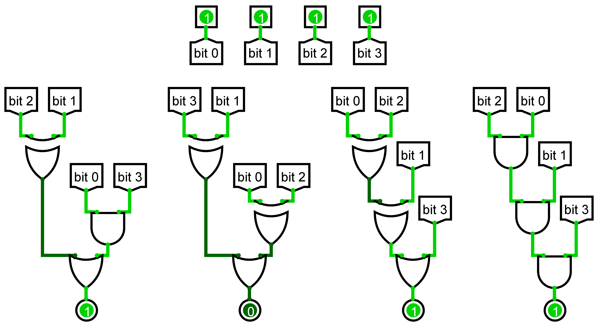

# Gates

The pricipal of gates challenge was to solve binary problems involving and, or and xor instructions.

## Gates 1/3

The first challenge was an entry in binary problem solving.



We had an image with some bytes and gates. The first gate is xor, the second a or and the last a and.

The picture is an example for the entry 1111 and we had to calculate the others (starting form 0001 and ending at 1110).

To do the work, I jusst created a python script to replicate each operation and printed the result.

```python

def circuit1(bit0, bit1, bit2, bit3):
    a = bit1^bit2
    b = bit0&bit3
    return a|b

def circuit2(bit0, bit1, bit2, bit3):
    a = bit1^bit3
    b = bit0^bit2
    return a|b

def circuit3(bit0, bit1, bit2, bit3):
    a = bit0^bit2
    b = a^bit1
    return b|bit3

def circuit4(bit0, bit1, bit2, bit3):
    a = bit0&bit2
    b = a&bit1
    return b&bit3

def main():
    awn = ""
    for i in range(16):
        binary = "0"*(6-len(bin(i))) + bin(i).replace("0b", "")
        bit0 = int(binary[0])
        bit1 = int(binary[1])
        bit2 = int(binary[2])
        bit3 = int(binary[3])

        c1 = circuit1(bit0, bit1, bit2, bit3)
        c2 = circuit2(bit0, bit1, bit2, bit3)
        c3 = circuit3(bit0, bit1, bit2, bit3)
        c4 = circuit4(bit0, bit1, bit2, bit3)
        awn += f"{bit0}{bit1}{bit2}{bit3} : {c1}{c2}{c3}{c4}\n"

    print(awn)

main()
```

The execution gave

```
0000 : 0000
0001 : 0110
0010 : 1110
0011 : 1110
0100 : 1110
0101 : 1010
0110 : 0100
0111 : 0110
1000 : 0110
1001 : 1110
1010 : 1000
1011 : 1110
1100 : 1100
1101 : 1110
1110 : 0110
1111 : 1011
```

It only remained to  select the one we needed and we got the flag.

[here](./gates1/gates1.py) is the source code for this part.


## Gates 2/3


This one was harder, we had the output for some inputs and we had to give the outputs for the ones that weren't in this list.

```
0101 : 0101
0111 : 1111
0110 : 0111
0011 : 0111
1001 : 0101
1110 : 1111
1011 : 1111
0100 : 1111
0001 : 1111
1000 : 1011
1100 : 0101
1010 : 0111
```


For this one I choosed to test each possiblity for each entry and then select one that was worked for all the entries.

```python
def in_all(l):
    """
    Takes a list of lists and returns the elements that are in
    all this list of lists
    """

    corres = l[0]
    for autre_l in l:
        for item in corres:
            if not item in autre_l:
                corres.remove(item)
    return corres


def t(bit0, bit1, bit2, bit3, resultat):
    """
    Returns all possible combinations for the 4 bits in parameter
    to give the result resultat
    
    bit0, bit1, bit2, bit4 -> int or str that is either a 0 or 1
    resultat -> str that is 4 time a 0 or 1
    """
    bit0 = int(bit0)
    bit1 = int(bit1)
    bit2 = int(bit2)
    bit3 = int(bit3)
    resultat = int(resultat)
    possible = ["^", "|", "&"]
    possible2 = ["bit0", "bit1", "bit2", "bit3"]

    results = []

    # test each combination
    for b1 in possible2:
        temp_pos = possible2[:]
        temp_pos.remove(b1)
        for b2 in temp_pos:
            temp_pos1 = temp_pos
            temp_pos1.remove(b2)
            for b3 in temp_pos1:
                temp_pos2 = temp_pos1
                temp_pos2.remove(b3)
                for b4 in temp_pos2:
                    for op1 in possible:
                        for op2 in possible:
                            for op3 in possible:
                                # if the result is good then add it to our list
                                if eval(f"{b1}{op1}{b2}{op2}{b3}{op3}{b4} == resultat"):
                                    results.append(f"{b1}{op1}{b2}{op2}{b3}{op3}{b4}")
    return results

def test():
    data = {
    "0101" : "0101",
    "0111" : "1111",
    "0110" : "0111",
    "0011" : "0111",
    "1001" : "0101",
    "1110" : "1111",
    "1011" : "1111",
    "0100" : "1111",
    "0001" : "1111",
    "1000" : "1011",
    "1100" : "0101",
    "1010" : "0111"
    }

    equ0 = []
    equ1 = []
    equ2 = []
    equ3 = []

    for input, expected in data.items():
        for i in range(4):
            eval(f"equ{i}.append(t(input[0], input[1], input[2], input[3], expected[i]))")


    # Once each possibilty has been tried, we only
    # print those who are true for all the inputs
    print("equ0 :", in_all(equ0))
    print("equ1 :", in_all(equ1))
    print("equ2 :", in_all(equ2))
    print("equ3 :", in_all(equ3))

test()
```

So, to do that, I created 2 functions, one called `in_all(l)` that had the role of returning all similarties in a list of lists. The second one, called `t(bit0, bit1, bit2, bit3, resultat)` had the role of returning all possible binary opperation between bit0, bit1, bit2 and bit3 to give resultat.

Then I had to execute this functions for each possibility given in the file we got upper. And the work was done.

By executing this file we got

```
equ0 : ['bit0^bit1^bit2^bit3', 'bit1^bit0^bit2^bit3', 'bit2^bit0^bit1^bit3', 'bit3^bit0^bit1^bit2']
equ1 : ['bit0|bit1|bit2|bit3', 'bit0&bit1|bit2|bit3', 'bit1^bit0&bit2|bit3', 'bit1|bit0|bit2|bit3', 'bit1|bit0&bit2|bit3', 'bit2|bit0^bit1|bit3', 'bit2|bit0&bit1^bit3', 'bit2&bit0|bit1|bit3', 'bit3|bit0|bit1|bit2', 'bit3|bit0&bit1|bit2', 'bit3&bit0|bit1|bit2']
equ2 : ['bit2|bit0^bit1^bit3', 'bit3^bit0^bit1|bit2']
equ3 : ['bit0|bit1|bit2|bit3', 'bit1|bit0|bit2|bit3', 'bit2|bit0|bit1|bit3', 'bit2&bit0|bit1|bit3', 'bit3^bit0|bit1|bit2', 'bit3|bit0^bit1|bit2', 'bit3|bit0|bit1|bit2', 'bit3&bit0|bit1|bit2']
```

So, I had to chose one and re-use the script done for gate 1 to generate the ones missing

```python
def circuit1(bit0, bit1, bit2, bit3):
    return bit0^bit1^bit2^bit3

def circuit2(bit0, bit1, bit2, bit3):
    return bit2&bit0|bit1|bit3

def circuit3(bit0, bit1, bit2, bit3):
    return bit2|bit0^bit1^bit3

def circuit4(bit0, bit1, bit2, bit3):
    return bit0 | bit1 | bit2 | bit3


def test():
    data = {
    "0101" : "0101",
    "0111" : "1111",
    "0110" : "0111",
    "0011" : "0111",
    "1001" : "0101",
    "1110" : "1111",
    "1011" : "1111",
    "0100" : "1111",
    "0001" : "1111",
    "1000" : "1011",
    "1100" : "0101",
    "1010" : "0111"
    }

    for input, expected in data.items():
        bit0 = int(input[0])
        bit1 = int(input[1])
        bit2 = int(input[2])
        bit3 = int(input[3])

        c1 = circuit1(bit0, bit1, bit2, bit3)
        c2 = circuit2(bit0, bit1, bit2, bit3)
        c3 = circuit3(bit0, bit1, bit2, bit3)
        c4 = circuit4(bit0, bit1, bit2, bit3)

        print(f"Given     => {bit0}{bit1}{bit2}{bit3} : {c1}{c2}{c3}{c4}")
        print(f"Should be => {bit0}{bit1}{bit2}{bit3} : {expected}")

def generate():
    awn = ""
    for i in range(16):
        binary = "0"*(6-len(bin(i))) + bin(i).replace("0b", "")
        bit0 = int(binary[0])
        bit1 = int(binary[1])
        bit2 = int(binary[2])
        bit3 = int(binary[3])

        c1 = circuit1(bit0, bit1, bit2, bit3)
        c2 = circuit2(bit0, bit1, bit2, bit3)
        c3 = circuit3(bit0, bit1, bit2, bit3)
        c4 = circuit4(bit0, bit1, bit2, bit3)
        awn += f"{bit0}{bit1}{bit2}{bit3} : {c1}{c2}{c3}{c4}\n"

    print(awn)

test()
generate()
```

To be sure that all had been generated without any errors, I created a function called test to try it. If we run it we can see that all the data was created without any issues. I only had to run the function `generate` to create the output and get the flag.

```
# output without the execution of test()

0000 : 0000
0001 : 1111
0010 : 1011
0011 : 0111
0100 : 1111
0101 : 0101
0110 : 0111
0111 : 1111
1000 : 1011
1001 : 0101
1010 : 0111
1011 : 1111
1100 : 0101
1101 : 1111
1110 : 1111
1111 : 0111
```

And with this, we got the flag.

[here](./gates2/gates2_equations.py) is the source code of the first file and [here](./gates2/gates2_generate.py) the second.

## Gates 3/3


This challenge was trickyer, we had 8 bits of input and 8 bits of output, each output was made of 6 bits from the input.

As for the previous challenge, we had a file with the input and output of some combinations.

To solve this challenge, it was to complicated to use the previous method, because it needed to much time to process all the informations.

So, I decided to change the strategy. To solve this challenge, I decided to create a file for each output bit, that contains all possible equations. Then the program would try all the possibilty and remove the equations that didn't fit. After executing that programm for all the input/output given in the challenge description, I could just choose one of the equation in the ones remaining in the file, to create all the other output and solve the challenge.

Here is the content of the file
```
01101001 : 11111111
11111001 : 11111101
01001111 : 10111011
01011001 : 00011011
00111001 : 11111001
11001010 : 00111001
00000110 : 01110011
01000011 : 11110011
11110001 : 10111111
00101110 : 10111011
10011001 : 00011011
11110111 : 11110011
11001111 : 11111011
01001101 : 11111010
11100010 : 11111001
10000100 : 11011011
11111011 : 10111100
00011110 : 11111111
10101100 : 10111011
11001001 : 00111011
00110000 : 11101011
00000100 : 00000010
01000111 : 11111011
01110001 : 11111111
01110110 : 11111111
10011000 : 01011011
01011011 : 01111010
00100010 : 11111001
01100001 : 10111111
10110000 : 10111011
11110100 : 11110011
10011110 : 00111111
00011111 : 10111111
10010101 : 11110011
01011000 : 01001011
11101001 : 10111110
01111100 : 11111011
01101100 : 10101011
00001000 : 01101001
11101011 : 11111111
11100000 : 10111001
10100101 : 10111010
11011011 : 10111001
00100001 : 11111001
10011100 : 01011011
01010100 : 00111011
01010111 : 10111111
00110001 : 10111011
00001111 : 11111011
10001110 : 11111011
10111100 : 11111011
10001001 : 11111011
10101000 : 10111011
11000100 : 00011011
00111010 : 11111011
11101110 : 10111011
11001100 : 01111011
01001011 : 10111011
01011100 : 01011011
11101101 : 10111110
00110110 : 10111111
00011100 : 10001011
00010100 : 11101011
11011010 : 11111011
10111010 : 10111011
10010000 : 00110011
00001001 : 00111011
11010011 : 11110011
10001101 : 11111011
00001011 : 01111011
01000110 : 10111011
11000010 : 01111001
11111110 : 11111110
00011010 : 11111011
10010010 : 01110011
11111010 : 11111010
10011111 : 11111111
00010000 : 11101011
11101100 : 11111010
11000000 : 00011001
11100011 : 10111101
00010010 : 10111010
11010010 : 10110011
01101000 : 10101011
01100110 : 10110011
10111011 : 11111011
10101010 : 11111011
10110001 : 11111011
11000101 : 11111011
00011101 : 11111011
01001000 : 10101010
11100111 : 10111111
10100100 : 11111010
10101001 : 11111011
11011001 : 11011001
11011111 : 10111111
10110101 : 11111011
01110101 : 11101111
10010111 : 10110111
01011111 : 11111110
01011110 : 00111110
01100101 : 10110111
```

Now, let's start the program. First thing we need to do is to create a file that conatians all possible equations for the first line of the input/output file given by the challenge.

So, first, we need to do a function that calculates aall the possibilities, as for gates 2/3.

```python
def t(bit0, bit1, bit2, bit3, bit4, bit5, bit6, bit7, resultat):
    bit0 = int(bit0)
    bit1 = int(bit1)
    bit2 = int(bit2)
    bit3 = int(bit3)
    bit4 = int(bit4)
    bit5 = int(bit5)
    bit6 = int(bit6)
    bit7 = int(bit7)
    resultat = int(resultat)
    possible = ["^", "|", "&"]
    possible2 = ["bit0", "bit1", "bit2", "bit3", "bit4", "bit5", "bit6", "bit7"]

    results = []

    for b1 in possible2:
        temp_pos = possible2[:]
        temp_pos.remove(b1)
        for b2 in temp_pos:
            temp_pos1 = temp_pos
            temp_pos1.remove(b2)
            for b3 in temp_pos1:
                temp_pos2 = temp_pos1[:]
                temp_pos2.remove(b3)
                for b4 in temp_pos2:
                    temp_pos3 = temp_pos2[:]
                    temp_pos3.remove(b4)
                    for b5 in temp_pos3:
                        temp_pos4 = temp_pos3[:]
                        temp_pos4.remove(b5)
                        for b6 in temp_pos4:
                                    for op1 in possible:
                                        for op2 in possible:
                                            for op3 in possible:
                                                for op4 in possible:
                                                    for op5 in possible:
                                                                if eval(f"{b1}{op1}{b2}{op2}{b3}{op3}{b4}{op4}{b5}{op5}{b6} == resultat"):
                                                                    results.append(f"{b1}{op1}{b2}{op2}{b3}{op3}{b4}{op4}{b5}{op5}{b6}")
    return results
```

Now that we have a function to do the work, we need to execute it for the first possibilty.

```py
from time import perf_counter

def test():
    data = {
    "01101001" : "11111111",
    }

    equ0 = []
    equ1 = []
    equ2 = []
    equ3 = []
    equ4 = []
    equ5 = []
    equ6 = []
    equ7 = []

    for input, expected in data.items():
        for i in range(8):
            print(f"Starting equ{i}")
            print("starting time:", perf_counter())
            eval(f"equ{i}.append(t(input[0], input[1], input[2], input[3], input[4], input[5], input[6], input[7], expected[i]))")
            with open("eq"+str(i), 'w') as f:
                f.write(str(eval("equ"+str(i))))
            print("ending time:", perf_counter())

test()
```

If we execute the programm, we can see this output.

```
Starting equ0
starting time: 2.2483437
ending time: 17.4881562
Starting equ1
starting time: 17.4882798
ending time: 34.5067851
Starting equ2
starting time: 34.5068874
ending time: 50.4943757
Starting equ3
starting time: 50.4945785
ending time: 66.4909525
Starting equ4
starting time: 66.4910504
ending time: 82.4478134
Starting equ5
starting time: 82.4478955
ending time: 97.8065475
Starting equ6
starting time: 97.8067465
ending time: 113.1484938
Starting equ7
starting time: 113.1486058
ending time: 128.4982543
```

And that some files have been created.


Now that we have the files, we need to test all the equations in this file and remove the one that aren't correct.

Let's firstly do a function that would test our equations.

```python
def t_v2(bit0, bit1, bit2, bit3, bit4, bit5, bit6, bit7, resultat, equs):
    bit0 = int(bit0)
    bit1 = int(bit1)
    bit2 = int(bit2)
    bit3 = int(bit3)
    bit4 = int(bit4)
    bit5 = int(bit5)
    bit6 = int(bit6)
    bit7 = int(bit7)
    resultat = int(resultat)

    equs2 = []
    print("Argument parsing")
    # split each equation in a list
    looping = equs.replace('[', '').replace(']', '').split(",")
    print("starting loop")
    for equation in looping:
        equation = str(equation).replace("'", "").replace(" ", "").replace("\"", "")
        try:
            if len(equation) == 29:
                # if the equation is right for this bits the we store it
                if eval(equation) == resultat:
                    equs2.append(equation)
            else:
                print("Length execption : " + equation)
        except:
            print("error")
            print(equation)
            exit()

    return str(equs2)
```

Now that we can test an input/output, let's create the main loop.

```python
def main():
    done = {
    "01101001" : "11111111",
    }
    data = {
    "11111001" : "11111101",
    "01001111" : "10111011",
    "01011001" : "00011011",
    "00111001" : "11111001",
    "11001010" : "00111001",
    "00000110" : "01110011",
    "01000011" : "11110011",
    "11110001" : "10111111",
    "00101110" : "10111011",
    "10011001" : "00011011",
    "11110111" : "11110011",
    "11001111" : "11111011",
    "01001101" : "11111010",
    "11100010" : "11111001",
    "10000100" : "11011011",
    "11111011" : "10111100",
    "00011110" : "11111111",
    "10101100" : "10111011",
    "11001001" : "00111011",
    "00110000" : "11101011",
    "00000100" : "00000010",
    "01000111" : "11111011",
    "01110001" : "11111111",
    "01110110" : "11111111",
    "10011000" : "01011011",
    "01011011" : "01111010",
    "00100010" : "11111001",
    "01100001" : "10111111",
    "10110000" : "10111011",
    "11110100" : "11110011",
    "10011110" : "00111111",
    "00011111" : "10111111",
    "10010101" : "11110011",
    "01011000" : "01001011",
    "11101001" : "10111110",
    "01111100" : "11111011",
    "01101100" : "10101011",
    "00001000" : "01101001",
    "11101011" : "11111111",
    "11100000" : "10111001",
    "10100101" : "10111010",
    "11011011" : "10111001",
    "00100001" : "11111001",
    "10011100" : "01011011",
    "01010100" : "00111011",
    "01010111" : "10111111",
    "00110001" : "10111011",
    "00001111" : "11111011",
    "10001110" : "11111011",
    "10111100" : "11111011",
    "10001001" : "11111011",
    "10101000" : "10111011",
    "11000100" : "00011011",
    "00111010" : "11111011",
    "11101110" : "10111011",
    "11001100" : "01111011",
    "01001011" : "10111011",
    "01011100" : "01011011",
    "11101101" : "10111110",
    "00110110" : "10111111",
    "00011100" : "10001011",
    "00010100" : "11101011",
    "11011010" : "11111011",
    "10111010" : "10111011",
    "10010000" : "00110011",
    "00001001" : "00111011",
    "11010011" : "11110011",
    "10001101" : "11111011",
    "00001011" : "01111011",
    "01000110" : "10111011",
    "11000010" : "01111001",
    "11111110" : "11111110",
    "00011010" : "11111011",
    "10010010" : "01110011",
    "11111010" : "11111010",
    "10011111" : "11111111",
    "00010000" : "11101011",
    "11101100" : "11111010",
    "11000000" : "00011001",
    "11100011" : "10111101",
    "00010010" : "10111010",
    "11010010" : "10110011",
    "01101000" : "10101011",
    "01100110" : "10110011",
    "10111011" : "11111011",
    "10101010" : "11111011",
    "10110001" : "11111011",
    "11000101" : "11111011",
    "00011101" : "11111011",
    "01001000" : "10101010",
    "11100111" : "10111111",
    "10100100" : "11111010",
    "10101001" : "11111011",
    "11011001" : "11011001",
    "11011111" : "10111111",
    "10110101" : "11111011",
    "01110101" : "11101111",
    "10010111" : "10110111",
    "01011111" : "11111110",
    "01011110" : "00111110",
    "01100101" : "10110111"
    }

    equ0 = []
    equ1 = []
    equ2 = []
    equ3 = []
    equ4 = []
    equ5 = []
    equ6 = []
    equ7 = []

    for input, expected in data.items():
        for i in range(8):
            print("opening equ"+str(i))
            # open the file
            with open("eq"+str(i), 'r') as f:
                equations = f.read()
            # test the equation
            eval(f"equ{i}.append(t_v2(input[0], input[1], input[2], input[3], input[4], input[5], input[6], input[7], expected[i], equations))")
            print(input, "done")
            print("Writting in", f"equ{i}")
            # change the file content
            with open("eq"+str(i), 'w') as f:
                f.write(str(eval(f"''.join(equ{i})")))

        print(input, "fully done, can be moved to done dict")
        equ0 = []
        equ1 = []
        equ2 = []
        equ3 = []
        equ4 = []
        equ5 = []
        equ6 = []
        equ7 = []

main()
```


```
opening equ0
Argument parsing
starting loop
11111001 done
Writting in equ0
opening equ1
Argument parsing
starting loop
11111001 done
Writting in equ1
opening equ2
Argument parsing
starting loop
11111001 done
Writting in equ2
opening equ3
Argument parsing
starting loop
11111001 done
Writting in equ3
opening equ4
Argument parsing
starting loop
11111001 done
Writting in equ4
opening equ5
Argument parsing
starting loop
11111001 done
Writting in equ5
opening equ6
Argument parsing
starting loop
11111001 done
Writting in equ6
opening equ7
Argument parsing
starting loop
11111001 done
Writting in equ7
11111001 fully done, can be moved to done dict
opening equ0
Argument parsing
starting loop
01001111 done
Writting in equ0
opening equ1
Argument parsing
starting loop
01001111 done
Writting in equ1
opening equ2
Argument parsing
starting loop
01001111 done
Writting in equ2
opening equ3
Argument parsing
starting loop
01001111 done
Writting in equ3
opening equ4
Argument parsing
starting loop
01001111 done
Writting in equ4
opening equ5
Argument parsing
starting loop
01001111 done
Writting in equ5
opening equ6
Argument parsing
starting loop
01001111 done
Writting in equ6
opening equ7
Argument parsing
starting loop
01001111 done
Writting in equ7
01001111 fully done, can be moved to done dict
opening equ0
Argument parsing
starting loop
01011001 done
.....
01100101 done
Writting in equ6
opening equ7
Argument parsing
starting loop
01100101 done
Writting in equ7
01100101 fully done, can be moved to done dict
```

Once the execution has ended (5-10min), we can choose a randome equation in the files to generate the rest of the table.

Let's do that with python program.


```python
def c1(bit0, bit1, bit2, bit3, bit4, bit5, bit6, bit7):
    return bit0^bit1^bit3|bit2|bit5&bit7

def c2(bit0, bit1, bit2, bit3, bit4, bit5, bit6, bit7):
    return bit0^bit1^bit3^bit4^bit6^bit7

def c3(bit0, bit1, bit2, bit3, bit4, bit5, bit6, bit7):
    return bit2|bit3^bit4|bit5&bit7|bit6

def c4(bit0, bit1, bit2, bit3, bit4, bit5, bit6, bit7):
    return bit0|bit1&bit3&bit5^bit7|bit6

def c5(bit0, bit1, bit2, bit3, bit4, bit5, bit6, bit7):
    return bit3^bit0|bit1&bit5^bit2|bit4

def c6(bit0, bit1, bit2, bit3, bit4, bit5, bit6, bit7):
    return bit7&bit2&bit1^bit3&bit5&bit6

def c7(bit0, bit1, bit2, bit3, bit4, bit5, bit6, bit7):
    return bit0^bit1|bit3^bit4&bit7|bit5

def c8(bit0, bit1, bit2, bit3, bit4, bit5, bit6, bit7):
    return bit2^bit0|bit1^bit4|bit3^bit6

def create_bit(b0, b1, b2, b3, b4, b5, b6, b7):
    b0 = int(b0)
    b1 = int(b1)
    b2 = int(b2)
    b3 = int(b3)
    b4 = int(b4)
    b5 = int(b5)
    b6 = int(b6)
    b7 = int(b7)

    r1 = c1(b0, b1, b2, b3, b4, b5, b6, b7)
    r2 = c2(b0, b1, b2, b3, b4, b5, b6, b7)
    r3 = c3(b0, b1, b2, b3, b4, b5, b6, b7)
    r4 = c4(b0, b1, b2, b3, b4, b5, b6, b7)
    r5 = c5(b0, b1, b2, b3, b4, b5, b6, b7)
    r6 = c6(b0, b1, b2, b3, b4, b5, b6, b7)
    r7 = c7(b0, b1, b2, b3, b4, b5, b6, b7)
    r8 = c8(b0, b1, b2, b3, b4, b5, b6, b7)
    return f"{r1}{r2}{r3}{r4}{r5}{r6}{r7}{r8}"

def testing():
    tests = {
    "01101001" : "11111111",
    "11111001" : "11111101",
    "01001111" : "10111011",
    "01011001" : "00011011",
    "00111001" : "11111001",
    "11001010" : "00111001",
    "00000110" : "01110011",
    "01000011" : "11110011",
    "11110001" : "10111111",
    "00101110" : "10111011",
    "10011001" : "00011011",
    "11110111" : "11110011",
    "11001111" : "11111011",
    "01001101" : "11111010",
    "11100010" : "11111001",
    "10000100" : "11011011",
    "11111011" : "10111100",
    "00011110" : "11111111",
    "10101100" : "10111011",
    "11001001" : "00111011",
    "00110000" : "11101011",
    "00000100" : "00000010",
    "01000111" : "11111011",
    "01110001" : "11111111",
    "01110110" : "11111111",
    "10011000" : "01011011",
    "01011011" : "01111010",
    "00100010" : "11111001",
    "01100001" : "10111111",
    "10110000" : "10111011",
    "11110100" : "11110011",
    "10011110" : "00111111",
    "00011111" : "10111111",
    "10010101" : "11110011",
    "01011000" : "01001011",
    "11101001" : "10111110",
    "01111100" : "11111011",
    "01101100" : "10101011",
    "00001000" : "01101001",
    "11101011" : "11111111",
    "11100000" : "10111001",
    "10100101" : "10111010",
    "11011011" : "10111001",
    "00100001" : "11111001",
    "10011100" : "01011011",
    "01010100" : "00111011",
    "01010111" : "10111111",
    "00110001" : "10111011",
    "00001111" : "11111011",
    "10001110" : "11111011",
    "10111100" : "11111011",
    "10001001" : "11111011",
    "10101000" : "10111011",
    "11000100" : "00011011",
    "00111010" : "11111011",
    "11101110" : "10111011",
    "11001100" : "01111011",
    "01001011" : "10111011",
    "01011100" : "01011011",
    "11101101" : "10111110",
    "00110110" : "10111111",
    "00011100" : "10001011",
    "00010100" : "11101011",
    "11011010" : "11111011",
    "10111010" : "10111011",
    "10010000" : "00110011",
    "00001001" : "00111011",
    "11010011" : "11110011",
    "10001101" : "11111011",
    "00001011" : "01111011",
    "01000110" : "10111011",
    "11000010" : "01111001",
    "11111110" : "11111110",
    "00011010" : "11111011",
    "10010010" : "01110011",
    "11111010" : "11111010",
    "10011111" : "11111111",
    "00010000" : "11101011",
    "11101100" : "11111010",
    "11000000" : "00011001",
    "11100011" : "10111101",
    "00010010" : "10111010",
    "11010010" : "10110011",
    "01101000" : "10101011",
    "01100110" : "10110011",
    "10111011" : "11111011",
    "10101010" : "11111011",
    "10110001" : "11111011",
    "11000101" : "11111011",
    "00011101" : "11111011",
    "01001000" : "10101010",
    "11100111" : "10111111",
    "10100100" : "11111010",
    "10101001" : "11111011",
    "11011001" : "11011001",
    "11011111" : "10111111",
    "10110101" : "11111011",
    "01110101" : "11101111",
    "10010111" : "10110111",
    "01011111" : "11111110",
    "01011110" : "00111110",
    "01100101" : "10110111"
    }

    for input, output in tests.items():
        val = create_bit(input[0], input[1], input[2],input[3], input[4], input[5], input[6], input[7])
        if output == val:
            print("ok", input)
        else:
            print('bad :', output, "=>", val)

    print("data : ")
    for i in range(0x100):
        nb_bin = "0" * (10 - len(bin(i))) + bin(i).replace("0b", "")

        if not nb_bin in tests.keys():
            val = create_bit(nb_bin[0], nb_bin[1], nb_bin[2], nb_bin[3], nb_bin[4], nb_bin[5], nb_bin[6], nb_bin[7])
            print(f"{nb_bin} : {val}")

testing()
```

If we execute the file, it creates the output.

```
ok 01101001
ok 11111001
ok 01001111
ok 01011001
ok 00111001
ok 11001010
ok 00000110
ok 01000011
ok 11110001
ok 00101110
ok 10011001
ok 11110111
ok 11001111
ok 01001101
ok 11100010
ok 10000100
ok 11111011
ok 00011110
ok 10101100
ok 11001001
ok 00110000
ok 00000100
ok 01000111
ok 01110001
ok 01110110
ok 10011000
ok 01011011
ok 00100010
ok 01100001
ok 10110000
ok 11110100
ok 10011110
ok 00011111
ok 10010101
ok 01011000
ok 11101001
ok 01111100
ok 01101100
ok 00001000
ok 11101011
ok 11100000
ok 10100101
ok 11011011
ok 00100001
ok 10011100
ok 01010100
ok 01010111
ok 00110001
ok 00001111
ok 10001110
ok 10111100
ok 10001001
ok 10101000
ok 11000100
ok 00111010
ok 11101110
ok 11001100
ok 01001011
ok 01011100
ok 11101101
ok 00110110
ok 00011100
ok 00010100
ok 11011010
ok 10111010
ok 10010000
ok 00001001
ok 11010011
ok 10001101
ok 00001011
ok 01000110
ok 11000010
ok 11111110
ok 00011010
ok 10010010
ok 11111010
ok 10011111
ok 00010000
ok 11101100
ok 11000000
ok 11100011
ok 00010010
ok 11010010
ok 01101000
ok 01100110
ok 10111011
ok 10101010
ok 10110001
ok 11000101
ok 00011101
ok 01001000
ok 11100111
ok 10100100
ok 10101001
ok 11011001
ok 11011111
ok 10110101
ok 01110101
ok 10010111
ok 01011111
ok 01011110
ok 01100101
data : 
00000000 : 00000000
00000001 : 01010000
00000010 : 01110001
00000011 : 00110001
00000101 : 11110010
00000111 : 10110011
00001010 : 00111001
00001100 : 01101011
00001101 : 10111011
00001110 : 00111011
00010001 : 10111011
00010011 : 11111010
00010101 : 10111011
00010110 : 10111110
00010111 : 11111110
00011000 : 10001011
00011001 : 11011001
00011011 : 10111001
00100000 : 10101001
00100011 : 10111001
00100100 : 10101011
00100101 : 11111011
00100110 : 11111011
00100111 : 10111011
00101000 : 11101001
00101001 : 10111011
00101010 : 10111001
00101011 : 11111011
00101100 : 11101011
00101101 : 10111011
00101111 : 11111011
00110010 : 10111011
00110011 : 11111011
00110100 : 11101011
00110101 : 10111011
00110111 : 11111111
00111000 : 10101011
00111011 : 10111001
00111100 : 10101011
00111101 : 11111011
00111110 : 11111111
00111111 : 10111111
01000000 : 11000011
01000001 : 10010011
01000010 : 10110011
01000100 : 11001011
01000101 : 10111011
01001001 : 11111010
01001010 : 11111011
01001100 : 10101010
01001110 : 11111011
01010000 : 00101011
01010001 : 01111011
01010010 : 01111011
01010011 : 00111011
01010101 : 11101011
01010110 : 01111111
01011010 : 00111010
01011101 : 10101011
01100000 : 11101011
01100010 : 10111011
01100011 : 11111111
01100100 : 11100011
01100111 : 11110111
01101010 : 11111011
01101011 : 10111111
01101101 : 11111111
01101110 : 11111011
01101111 : 10111111
01110000 : 10101011
01110010 : 11111011
01110011 : 10111111
01110100 : 10111011
01110111 : 10111011
01111000 : 11101011
01111001 : 10111111
01111010 : 10111011
01111011 : 11111111
01111101 : 10101111
01111110 : 10111111
01111111 : 11111011
10000000 : 11011011
10000001 : 10011011
10000010 : 10111011
10000011 : 11111011
10000101 : 10111011
10000110 : 10111011
10000111 : 11111011
10001000 : 10111011
10001010 : 11111011
10001011 : 10111011
10001100 : 10111011
10001111 : 10111011
10010001 : 01110011
10010011 : 00110011
10010100 : 00110011
10010110 : 01110111
10011010 : 00111011
10011011 : 01111011
10011101 : 10111011
10100000 : 11111010
10100001 : 10111010
10100010 : 10111011
10100011 : 11111011
10100110 : 10111011
10100111 : 11111011
10101011 : 10111011
10101101 : 11111011
10101110 : 11111011
10101111 : 10111011
10110010 : 11111010
10110011 : 10111010
10110100 : 10111011
10110110 : 11111110
10110111 : 10111110
10111000 : 11111011
10111001 : 10111011
10111101 : 10111011
10111110 : 10111111
10111111 : 11111111
11000001 : 01011001
11000011 : 00111001
11000110 : 01111011
11000111 : 10111011
11001000 : 01111001
11001011 : 01111011
11001101 : 10111011
11001110 : 00111011
11010000 : 11110011
11010001 : 10110011
11010100 : 11111011
11010101 : 10111011
11010110 : 10111111
11010111 : 11111111
11011000 : 10011011
11011100 : 10011011
11011101 : 11111011
11011110 : 11111111
11100001 : 11111101
11100100 : 10111011
11100101 : 11111111
11100110 : 11111011
11101000 : 11111000
11101010 : 10111001
11101111 : 11111111
11110000 : 11111011
11110010 : 10111011
11110011 : 11111111
11110101 : 10110111
11110110 : 10110111
11111000 : 10111011
11111100 : 10111011
11111101 : 11111111
11111111 : 10111010
```

It only remains to submit our result and it validates the challenge.

[Here](./gates3/create_files.py) is the source code for the first file (create the files for the first equation). [Here](./gates3/change_files.py) is the source code for the second file (change the files to make them fit all equations). And [here](./gates3/generate_result_and_test.py) is the source code for the third file (generate the result and testing).

Thank you for reading.